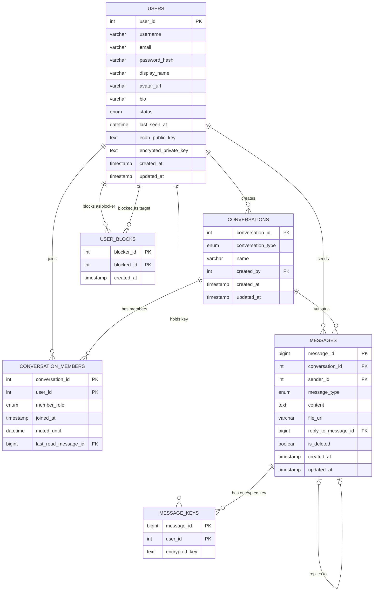
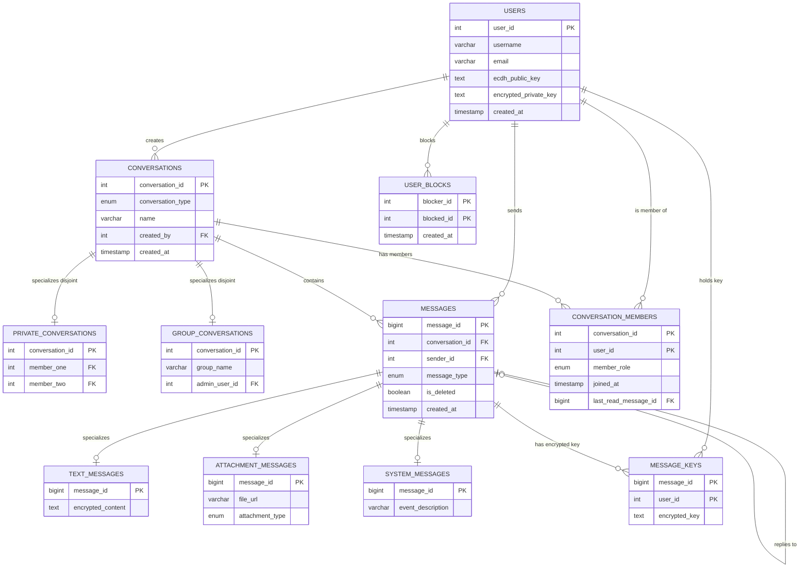

# CipherChat: A Real-Time Encrypted Messaging Platform
**Academic Project Report**

---

### **Student Information**
* **Name:** M.Anas Faheem Khan
* **SAP ID:** 70174002
* **Project Name:** CipherChat (Secure Messaging System)
* **Date:** June 2026

---

## 1. Executive Summary

**CipherChat** is a full-stack, real-time messaging application built with **End-to-End Encryption (E2EE)**, **JWT-based authentication**, and **bcrypt password hashing**. The server acts as a blind relay — it stores only ciphertext and never has access to plaintext messages or private keys.

**Key features:**
- Zero-knowledge server: all encryption runs in the browser
- Real-time messaging via Socket.io WebSockets
- ECDH P-256 key agreement + AES-GCM 256-bit encryption
- JWT sessions with bcrypt-hashed passwords
- Cloudinary-hosted encrypted file attachments

> For a detailed, plain-English explanation of how E2EE, authentication, and password hashing work, see **[Security_Architecture.md](./Security_Architecture.md)**.

---

## 2. Working of the Project

```
       +-------------------------------------------------------------+
       |                  CLIENTS (React 19 SPA)                     |
       |  - All encryption/decryption runs here (Web Crypto API)     |
       +------------------------------+------------------------------+
                                      |
                      HTTP API        |        WebSockets
                     (Axios)          |        (Socket.io)
                                      v
       +-------------------------------------------------------------+
       |             BACKEND GATEWAY (Node.js & Express)             |
       |  - JWT Authentication Middleware                            |
       |  - REST API Routes (auth, chat, users)                      |
       |  - Attachment Upload Pipeline (Multer + Cloudinary)         |
       +------------------------------+------------------------------+
                                      |
                                      v
       +-------------------------------------------------------------+
       |                 DATABASE PERSISTENCE (MySQL)                |
       |  - Relational InnoDB Schema                                 |
       |  - FK Constraints & Composite Indexes                       |
       |  - Stores only ciphertext, never plaintext                  |
       +-------------------------------------------------------------+
```

**Step-by-step flow:**
1. User registers → browser generates ECDH keypair, encrypts private key with password, uploads public key + encrypted private key.
2. User logs in → server validates bcrypt hash, returns JWT + encrypted private key; browser decrypts private key locally.
3. Sending a message → browser encrypts with AES-GCM, backend stores ciphertext, Socket.io broadcasts to recipients.
4. Receiving a message → browser uses ECDH key agreement to derive shared secret, decrypts session key, decrypts message.
5. File uploads → files are encrypted in-browser before leaving the device, stored as raw blobs on Cloudinary.

---

### **How It Works — In Simple Terms**

**👤 Users & Accounts:**
When someone signs up, their details (username, email, hashed password, display name) are saved in the **`users` table**. Passwords are never stored as-is — they go through **bcrypt hashing** first, so even if the database leaks, passwords are safe. Each user also gets a cryptographic public key stored here, which is used for secure messaging. On login, the server verifies the password hash and issues a **JWT token** that the user attaches to every future request — no need to log in again on each action.

**💬 Conversations & Members:**
Every chat — whether between two people or a group — is a row in the **`conversations` table**. The type column tells if it's `private` or `group`. Who's in that chat is tracked in the **`conversation_members` table**, which links users to conversations. This is a many-to-many relationship — one user can be in many chats, one chat can have many users. Each member record also tracks their **role** (`member` or `admin`) and a pointer to the **last message they've read** — this is how unread message counts are calculated efficiently.

**📨 Messages:**
Every message sent is stored as a row in the **`messages` table**. It stores what type of message it is (text, image, file, audio, voice), the encrypted content, who sent it, and which conversation it belongs to. Messages support **soft deletion** — when deleted, the row stays in the database but the content is replaced with `[DELETED]` and a flag is set. This keeps reply threads intact. Messages can also **reply to other messages** via a self-referencing foreign key (`reply_to_message_id` pointing back to the same table).

**📁 File Attachments:**
For images, files, and voice notes, the encrypted binary is uploaded to **Cloudinary** (cloud storage). The database only stores the resulting Cloudinary URL in `messages.file_url`. This keeps the database lean — it stores links, not raw files.

**🔑 Encryption Keys (message_keys table):**
For secure messaging, each message has a separate encrypted session key stored in the **`message_keys` table** — one row per recipient. This is how the system supports group chats securely: each participant gets their own copy of the key, encrypted specifically for them. The server just stores and delivers these key blobs — it cannot decrypt them.

**🚫 Blocking:**
If a user blocks someone, a row is added to the **`user_blocks` table** with both user IDs. Before any message or conversation is allowed, the backend checks this table to see if a block exists in either direction.

**⚡ Real-Time Layer:**
The backend runs a **Socket.io** WebSocket server alongside the REST API. When a message is saved to the database, the server immediately emits it to the recipient's socket — no polling needed. When a user connects, their `status` in the `users` table is set to `online`; when they disconnect, it's set to `offline` and `last_seen_at` is recorded. Typing indicators and read receipts are pure socket events — they don't touch the database at all.

**🗄️ Database Design Highlights:**
- All tables use the **InnoDB** engine for foreign key support and ACID transactions.
- **Composite indexes** on `(conversation_id, created_at)` make loading message history fast even with millions of rows.
- **Foreign key constraints** with `ON DELETE CASCADE` automatically clean up orphaned records (e.g., deleting a conversation removes all its messages and member records).
- The conversations list with last-message previews and unread counts is fetched in a **single optimized query** using correlated subqueries — no extra round trips.

---

## 3. All Entities with Their Attributes Listed

### **3.1 Table: `users`**

| Column | Data Type | Key | Default | Description |
|---|---|---|---|---|
| `user_id` | `INT UNSIGNED` | **PK** | Auto-Inc | Unique user ID |
| `username` | `VARCHAR(30)` | **UK** | — | Unique login handle |
| `email` | `VARCHAR(255)` | **UK** | — | Unique email |
| `password_hash` | `VARCHAR(255)` | — | — | bcrypt-hashed password |
| `display_name` | `VARCHAR(100)` | — | — | Public name |
| `avatar_url` | `VARCHAR(500)` | — | `NULL` | Cloudinary picture URL |
| `bio` | `VARCHAR(255)` | — | `NULL` | Short bio |
| `status` | `ENUM` | — | `'offline'` | `offline/online/away/busy` |
| `last_seen_at` | `DATETIME` | — | `NULL` | Last active timestamp |
| `ecdh_public_key` | `TEXT` | — | `NULL` | ECDH public key (shared openly) |
| `encrypted_private_key` | `TEXT` | — | `NULL` | ECDH private key encrypted by user's password |
| `created_at` | `TIMESTAMP` | — | `NOW()` | Account creation time |
| `updated_at` | `TIMESTAMP` | — | Auto | Last modification time |

### **3.2 Table: `conversations`**

| Column | Data Type | Key | Default | Description |
|---|---|---|---|---|
| `conversation_id` | `INT UNSIGNED` | **PK** | Auto-Inc | Unique chat ID |
| `conversation_type` | `ENUM` | Index | — | `'private'` or `'group'` |
| `name` | `VARCHAR(100)` | — | `NULL` | Group name (NULL for private) |
| `created_by` | `INT UNSIGNED` | **FK** | — | References `users.user_id` |
| `created_at` | `TIMESTAMP` | — | `NOW()` | When conversation started |
| `updated_at` | `TIMESTAMP` | — | Auto | Last activity time |

### **3.3 Table: `conversation_members`**

| Column | Data Type | Key | Default | Description |
|---|---|---|---|---|
| `conversation_id` | `INT UNSIGNED` | **PK,FK** | — | References `conversations` |
| `user_id` | `INT UNSIGNED` | **PK,FK** | — | References `users` |
| `member_role` | `ENUM` | — | `'member'` | `'member'` or `'admin'` |
| `joined_at` | `TIMESTAMP` | — | `NOW()` | Join time |
| `muted_until` | `DATETIME` | — | `NULL` | Mute expiry |
| `last_read_message_id` | `BIGINT UNSIGNED` | **FK** | `NULL` | Last read message pointer |

### **3.4 Table: `messages`**

| Column | Data Type | Key | Default | Description |
|---|---|---|---|---|
| `message_id` | `BIGINT UNSIGNED` | **PK** | Auto-Inc | Unique message ID |
| `conversation_id` | `INT UNSIGNED` | **FK** | — | References `conversations` |
| `sender_id` | `INT UNSIGNED` | **FK** | — | References `users` |
| `message_type` | `ENUM` | — | `'text'` | `text/image/file/system/audio/voice` |
| `content` | `TEXT` | — | `NULL` | AES-GCM encrypted ciphertext (Base64) |
| `file_url` | `VARCHAR(500)` | — | `NULL` | Cloudinary URL for attachments |
| `reply_to_message_id` | `BIGINT UNSIGNED` | **FK** | `NULL` | Self-reference for threads |
| `is_deleted` | `BOOLEAN` | — | `FALSE` | Soft delete flag |
| `created_at` | `TIMESTAMP` | — | `NOW()` | Send time |
| `updated_at` | `TIMESTAMP` | — | Auto | Edit time |

### **3.5 Table: `message_keys`**

| Column | Data Type | Key | Default | Description |
|---|---|---|---|---|
| `message_id` | `BIGINT UNSIGNED` | **PK,FK** | — | References `messages` |
| `user_id` | `INT UNSIGNED` | **PK,FK** | — | References `users` (recipient) |
| `encrypted_key` | `TEXT` | — | — | Session AES key encrypted with ECDH KEK |

### **3.6 Table: `user_blocks`**

| Column | Data Type | Key | Default | Description |
|---|---|---|---|---|
| `blocker_id` | `INT UNSIGNED` | **PK,FK** | — | User who blocked |
| `blocked_id` | `INT UNSIGNED` | **PK,FK** | — | User who is blocked |
| `created_at` | `TIMESTAMP` | — | `NOW()` | When block was placed |

---

## 4. Entity Relationship Diagram (ERD)



---

## 5. Enhanced Entity Relationship Diagram (EERD)

The EERD models **specialization** — where a supertype entity branches into subtypes with their own unique attributes.

| Supertype | Subtypes | Constraint |
|---|---|---|
| `CONVERSATIONS` | `PRIVATE_CONVERSATIONS`, `GROUP_CONVERSATIONS` | Disjoint (either private OR group) |
| `MESSAGES` | `TEXT_MESSAGES`, `ATTACHMENT_MESSAGES`, `SYSTEM_MESSAGES` | Disjoint (exactly one type per message) |



---

## 6. Tables and Queries

### **6.1 Table Definitions (SQL)**

```sql
CREATE DATABASE IF NOT EXISTS chat_app
  CHARACTER SET utf8mb4 COLLATE utf8mb4_0900_ai_ci;
USE chat_app;

-- 1. USERS
CREATE TABLE users (
    user_id INT UNSIGNED AUTO_INCREMENT PRIMARY KEY,
    username VARCHAR(30) NOT NULL,
    email VARCHAR(255) NOT NULL,
    password_hash VARCHAR(255) NOT NULL,
    display_name VARCHAR(100) NOT NULL,
    avatar_url VARCHAR(500) DEFAULT NULL,
    bio VARCHAR(255) DEFAULT NULL,
    status ENUM('offline','online','away','busy') NOT NULL DEFAULT 'offline',
    last_seen_at DATETIME DEFAULT NULL,
    ecdh_public_key TEXT DEFAULT NULL,
    encrypted_private_key TEXT DEFAULT NULL,
    created_at TIMESTAMP NOT NULL DEFAULT CURRENT_TIMESTAMP,
    updated_at TIMESTAMP NOT NULL DEFAULT CURRENT_TIMESTAMP ON UPDATE CURRENT_TIMESTAMP,
    UNIQUE KEY uq_users_username (username),
    UNIQUE KEY uq_users_email (email)
) ENGINE=InnoDB;

-- 2. CONVERSATIONS
CREATE TABLE conversations (
    conversation_id INT UNSIGNED AUTO_INCREMENT PRIMARY KEY,
    conversation_type ENUM('private','group') NOT NULL,
    name VARCHAR(100) DEFAULT NULL,
    created_by INT UNSIGNED NOT NULL,
    created_at TIMESTAMP NOT NULL DEFAULT CURRENT_TIMESTAMP,
    updated_at TIMESTAMP NOT NULL DEFAULT CURRENT_TIMESTAMP ON UPDATE CURRENT_TIMESTAMP,
    CONSTRAINT fk_conversations_created_by
        FOREIGN KEY (created_by) REFERENCES users(user_id)
        ON DELETE RESTRICT ON UPDATE CASCADE,
    KEY idx_conversations_created_by (created_by),
    KEY idx_conversations_type (conversation_type)
) ENGINE=InnoDB;

-- 3. MESSAGES
CREATE TABLE messages (
    message_id BIGINT UNSIGNED AUTO_INCREMENT PRIMARY KEY,
    conversation_id INT UNSIGNED NOT NULL,
    sender_id INT UNSIGNED NOT NULL,
    message_type ENUM('text','image','file','system','audio','voice') NOT NULL DEFAULT 'text',
    content TEXT DEFAULT NULL,
    file_url VARCHAR(500) DEFAULT NULL,
    reply_to_message_id BIGINT UNSIGNED DEFAULT NULL,
    is_deleted BOOLEAN NOT NULL DEFAULT FALSE,
    created_at TIMESTAMP NOT NULL DEFAULT CURRENT_TIMESTAMP,
    updated_at TIMESTAMP NOT NULL DEFAULT CURRENT_TIMESTAMP ON UPDATE CURRENT_TIMESTAMP,
    CONSTRAINT fk_messages_conversation
        FOREIGN KEY (conversation_id) REFERENCES conversations(conversation_id)
        ON DELETE CASCADE ON UPDATE CASCADE,
    CONSTRAINT fk_messages_sender
        FOREIGN KEY (sender_id) REFERENCES users(user_id)
        ON DELETE RESTRICT ON UPDATE CASCADE,
    CONSTRAINT fk_messages_reply
        FOREIGN KEY (reply_to_message_id) REFERENCES messages(message_id)
        ON DELETE SET NULL ON UPDATE CASCADE,
    KEY idx_messages_conversation_time (conversation_id, created_at),
    KEY idx_messages_sender (sender_id)
) ENGINE=InnoDB;

-- 4. CONVERSATION_MEMBERS
CREATE TABLE conversation_members (
    conversation_id INT UNSIGNED NOT NULL,
    user_id INT UNSIGNED NOT NULL,
    member_role ENUM('member','admin') NOT NULL DEFAULT 'member',
    joined_at TIMESTAMP NOT NULL DEFAULT CURRENT_TIMESTAMP,
    muted_until DATETIME DEFAULT NULL,
    last_read_message_id BIGINT UNSIGNED DEFAULT NULL,
    PRIMARY KEY (conversation_id, user_id),
    CONSTRAINT fk_cm_conversation
        FOREIGN KEY (conversation_id) REFERENCES conversations(conversation_id)
        ON DELETE CASCADE ON UPDATE CASCADE,
    CONSTRAINT fk_cm_user
        FOREIGN KEY (user_id) REFERENCES users(user_id)
        ON DELETE CASCADE ON UPDATE CASCADE,
    CONSTRAINT fk_cm_last_read_message
        FOREIGN KEY (last_read_message_id) REFERENCES messages(message_id)
        ON DELETE SET NULL ON UPDATE CASCADE,
    KEY idx_cm_user (user_id)
) ENGINE=InnoDB;

-- 5. USER_BLOCKS
CREATE TABLE user_blocks (
    blocker_id INT UNSIGNED NOT NULL,
    blocked_id INT UNSIGNED NOT NULL,
    created_at TIMESTAMP NOT NULL DEFAULT CURRENT_TIMESTAMP,
    PRIMARY KEY (blocker_id, blocked_id),
    CONSTRAINT fk_blocks_blocker
        FOREIGN KEY (blocker_id) REFERENCES users(user_id)
        ON DELETE CASCADE ON UPDATE CASCADE,
    CONSTRAINT fk_blocks_blocked
        FOREIGN KEY (blocked_id) REFERENCES users(user_id)
        ON DELETE CASCADE ON UPDATE CASCADE,
    KEY idx_blocks_blocked (blocked_id)
) ENGINE=InnoDB;

-- 6. MESSAGE_KEYS (E2EE Key Distribution)
CREATE TABLE IF NOT EXISTS message_keys (
    message_id BIGINT UNSIGNED NOT NULL,
    user_id INT UNSIGNED NOT NULL,
    encrypted_key TEXT NOT NULL,
    PRIMARY KEY (message_id, user_id),
    CONSTRAINT fk_mk_message
        FOREIGN KEY (message_id) REFERENCES messages(message_id)
        ON DELETE CASCADE ON UPDATE CASCADE,
    CONSTRAINT fk_mk_user
        FOREIGN KEY (user_id) REFERENCES users(user_id)
        ON DELETE CASCADE ON UPDATE CASCADE
) ENGINE=InnoDB;
```

---

### **6.2 All Database Queries**

#### **Authentication (`auth.js`)**

**Q1 — Register user with E2EE credentials:**
```sql
INSERT INTO users (username, email, password_hash, display_name, ecdh_public_key, encrypted_private_key)
VALUES (?, ?, ?, ?, ?, ?);
```

**Q2 — Search users:**
```sql
SELECT user_id, username, display_name, avatar_url, bio, status
FROM users WHERE username LIKE ? OR display_name LIKE ?;
```

---

#### **User Profile & Moderation (`users.js`)**

**Q3 — Block a user:**
```sql
INSERT INTO user_blocks (blocker_id, blocked_id) VALUES (?, ?);
```

**Q4 — Unblock a user:**
```sql
DELETE FROM user_blocks WHERE blocker_id = ? AND blocked_id = ?;
```

**Q5 — Get all blocked users:**
```sql
SELECT blocked_id FROM user_blocks WHERE blocker_id = ?;
```

**Q6 — Check if block exists (either direction):**
```sql
SELECT * FROM user_blocks
WHERE (blocker_id = ? AND blocked_id = ?) OR (blocker_id = ? AND blocked_id = ?);
```

**Q7 — Fetch user profile:**
```sql
SELECT user_id, username, email, display_name, avatar_url, bio, status, last_seen_at
FROM users WHERE user_id = ?;
```

**Q8 — Update display name and bio:**
```sql
UPDATE users SET display_name = ?, bio = ? WHERE user_id = ?;
```

**Q9 — Update avatar URL:**
```sql
UPDATE users SET avatar_url = ? WHERE user_id = ?;
```

---

#### **Chat & Messaging (`chat.js`)**

**Q10 — Fetch conversations with last message and unread count:**
```sql
SELECT
    c.conversation_id, c.conversation_type, c.name, c.updated_at,
    (SELECT u.display_name FROM users u
     JOIN conversation_members cm2 ON u.user_id = cm2.user_id
     WHERE cm2.conversation_id = c.conversation_id AND cm2.user_id != ? LIMIT 1) AS other_user_name,
    (SELECT m.content FROM messages m
     WHERE m.conversation_id = c.conversation_id ORDER BY m.created_at DESC LIMIT 1) AS last_message_content,
    (SELECT m.message_type FROM messages m
     WHERE m.conversation_id = c.conversation_id ORDER BY m.created_at DESC LIMIT 1) AS last_message_type,
    (SELECT m.is_deleted FROM messages m
     WHERE m.conversation_id = c.conversation_id ORDER BY m.created_at DESC LIMIT 1) AS last_message_deleted,
    (SELECT COUNT(*) FROM messages m
     WHERE m.conversation_id = c.conversation_id
       AND m.message_id > IFNULL(cm.last_read_message_id, 0)
       AND m.sender_id != ?) AS unread_count
FROM conversations c
JOIN conversation_members cm ON c.conversation_id = cm.conversation_id
WHERE cm.user_id = ?
ORDER BY c.updated_at DESC;
```

**Q11 — Get all members and ECDH public keys (for key exchange):**
```sql
SELECT u.user_id, u.username, u.ecdh_public_key
FROM conversation_members cm
JOIN users u ON cm.user_id = u.user_id
WHERE cm.conversation_id = ?;
```

**Q12 — Find existing private conversation between two users:**
```sql
SELECT c.conversation_id FROM conversations c
JOIN conversation_members cm1 ON c.conversation_id = cm1.conversation_id AND cm1.user_id = ?
JOIN conversation_members cm2 ON c.conversation_id = cm2.conversation_id AND cm2.user_id = ?
WHERE c.conversation_type = 'private';
```

**Q13 — Add members to a group:**
```sql
INSERT INTO conversation_members (conversation_id, user_id, member_role) VALUES ?;
```

**Q14 — Fetch full message history with E2EE keys and reply context:**
```sql
SELECT m.*, u.username, u.display_name,
       rm.content AS reply_content, rm.message_type AS reply_type,
       ru.display_name AS reply_display_name,
       mk.encrypted_key,
       sender.ecdh_public_key AS sender_ecdh_public_key
FROM messages m
JOIN users u ON m.sender_id = u.user_id
LEFT JOIN messages rm ON m.reply_to_message_id = rm.message_id
LEFT JOIN users ru ON rm.sender_id = ru.user_id
LEFT JOIN message_keys mk ON m.message_id = mk.message_id AND mk.user_id = ?
LEFT JOIN users sender ON m.sender_id = sender.user_id
WHERE m.conversation_id = ?
ORDER BY m.created_at ASC;
```

**Q15 — Mark messages as read:**
```sql
UPDATE conversation_members
SET last_read_message_id = (SELECT MAX(message_id) FROM messages WHERE conversation_id = ?)
WHERE conversation_id = ? AND user_id = ?;
```

**Q16 — Edit a message:**
```sql
UPDATE messages SET content = ?, updated_at = NOW()
WHERE message_id = ? AND sender_id = ?;
```

**Q17 — Soft-delete a message:**
```sql
UPDATE messages SET is_deleted = TRUE, content = '[DELETED]'
WHERE message_id = ? AND sender_id = ?;
```

**Q18 — Store encrypted session keys for all recipients:**
```sql
INSERT INTO message_keys (message_id, user_id, encrypted_key) VALUES ?;
```

---

#### **WebSocket Presence (`server.js`)**

**Q19 — Mark user online:**
```sql
UPDATE users SET status = 'online' WHERE user_id = ?;
```

**Q20 — Mark user offline and record last seen:**
```sql
UPDATE users SET status = 'offline', last_seen_at = NOW() WHERE user_id = ?;
```

---

#### **Setup & Migration (`setup.js` & `migrate.js`)**

**Q21 — Add E2EE columns (migration):**
```sql
ALTER TABLE users ADD COLUMN ecdh_public_key TEXT DEFAULT NULL;
ALTER TABLE users ADD COLUMN encrypted_private_key TEXT DEFAULT NULL;
```

**Q22 — Seed test accounts:**
```sql
INSERT INTO users (username, email, password_hash, display_name, bio) VALUES
('neo', 'neo@matrix.com', ?, 'Neo', 'The One'),
('morpheus', 'morpheus@matrix.com', ?, 'Morpheus', 'Nebuchadnezzar Captain'),
('trinity', 'trinity@matrix.com', ?, 'Trinity', 'First Mate');
```

---

## 7. Summary

**CipherChat** is a production-grade, real-time secure messaging platform demonstrating that a zero-knowledge server architecture is achievable in a standard Node.js + MySQL full-stack setup.

- **E2EE:** All message encryption/decryption happens entirely in the browser. The server stores only ciphertext and encrypted keys it cannot read.
- **Authentication:** JWT-based sessions with bcrypt password hashing ensure secure login without exposing credentials.
- **Key Exchange:** ECDH P-256 lets two users derive a shared secret without ever transmitting it.
- **Encryption:** AES-GCM 256-bit with unique session keys and IVs per message.
- **Database:** 6-table normalized MySQL schema with composite indexes, foreign key constraints, soft deletes, and message threading.
- **Real-Time:** Socket.io with JWT-authenticated handshakes powers messaging, typing indicators, read receipts, and presence.

> Full technical documentation of E2EE, authentication, and password hashing → **[Security_Architecture.md](./Security_Architecture.md)**
